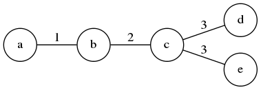
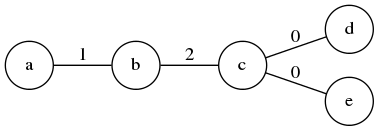

## GraphTheory.NET

It has been a while since I posted anything. There have been lots of things happening behind the scenes, but it has resulted in some good news: the latest version of the GraphTheory NuGet package should let developers easily build graphs.

### New Graph Objects

Right now, there are two primar types of graphs supported by the GraphTheory.NET API: undirected and weighted-undirected graphs. Let's start with the easiest type of graph, check it out:

```cs
var graph = new Graph< int >();
```

You can see that the `graph` object represents an unweighted and undirected graph where the nodes hold on to `int` data. New graphs are always empty and you have to populate the graph with nodes and edges (read on).

#### What about weighted graphs?

Creating a weighted and undirected graph is just as easy, check it out:

```cs
var graph = new Graph< int,float >();
```

In this case, the `graph` object represents a weighted and undirected graph where the nodes hold onto `int` data and the weights are represented by `float` data. Again, new graphs are always empty and you have to poulate the graph with nodes and edges.

### Wiring-Up Graphs

Okay, so we can create a graph object, then what do we do? Let's fill it up with some data:

```cs
var graph = new Graph< string >();
graph.Insert("a", "b", "c", "d", "e");
```

This will create the following graph:


#### Okay but where are the edges?

This is where the GraphTheory.NET library makes a lot of sense. We are trying to make it brain dead simple to create graphs. Turns out we think that means it should be easy to specify the edges (its pretty brain dead simple to specify nodes already). Check out the following:

```cs
var graph = new Graph< string >();
graph.Insert("a", "b", "c", "d", "e");
graph.Select("a").ConnectTo("b").ThenTo("c").ThenTo("d", "e");
```

This will produce the following graph:


#### And what about weighted Graphs?

I have yet to write the code to make the following work; however, I do think that its fairly easy to write---I just need to find the time. Anyway, I have been thinking about this one a lot and I think I found a way that makes sense but there is a small catch... 

Okay, lets add weights to the graph above. How do we do that?

```cs
var graph = new Graph< string,int >();
graph.Insert("a", "b", "c", "d", "e");
graph.Select("a").ConntectTo("b").Weighing(1)
                 .ThenTo("c").Weighing(2)
                 .ThenTo("d", "e").Weighing(3);
```

This will create the following graph:



So, what's the catch? I think its easier if you see it yourself. Let's break this down one step at a time. First, let's connect `a` and `b` together.

```cs
var graph = new Graph< string,int >();
graph.Insert("a", "b", "c", "d", "e");
graph.Select("a").ConntectTo("b");
```

What does our graph look like now?


What's with the `0`? Well, since you haven't specified a weight yet, you get the default value associated with the weight type. If you rolled out your own custom weight class, then it would be null; however, if it was a struct then it would be created with the default constructor. Let's continue.

```cs
graph.Select("a").ConnectTo("b").Weighing(1);
```


The rest would look like this:





Its just something to keep in mind. You can always use some sort of synchronization construct (lock, semaphor, mutex, etc.) if this sort of behavior is a problem.
